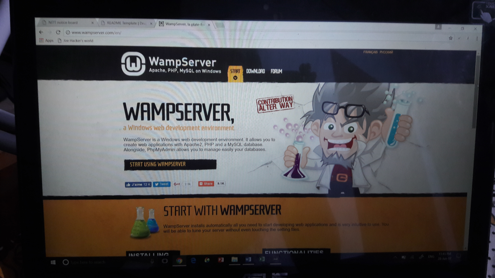
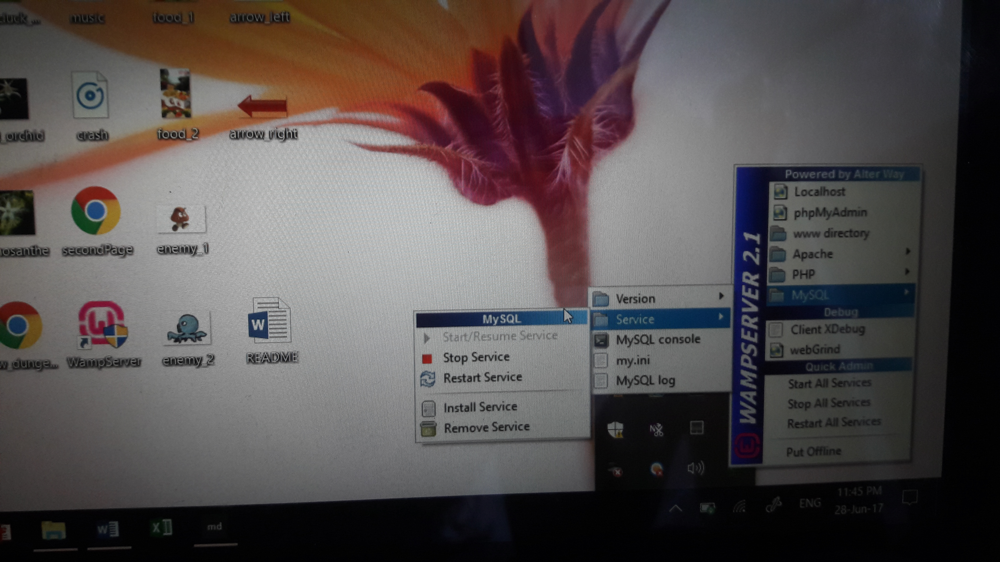
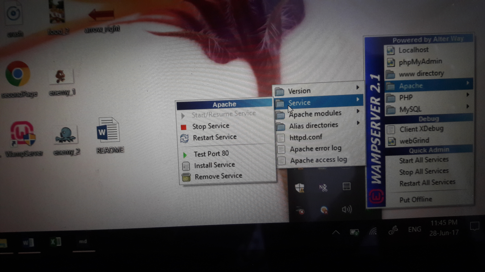
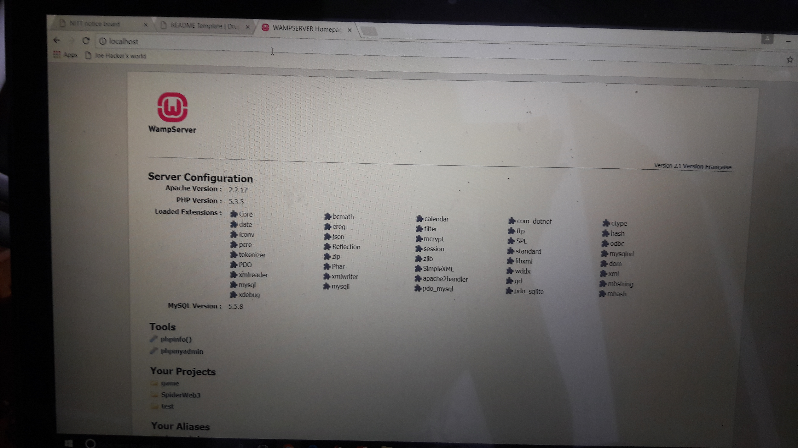
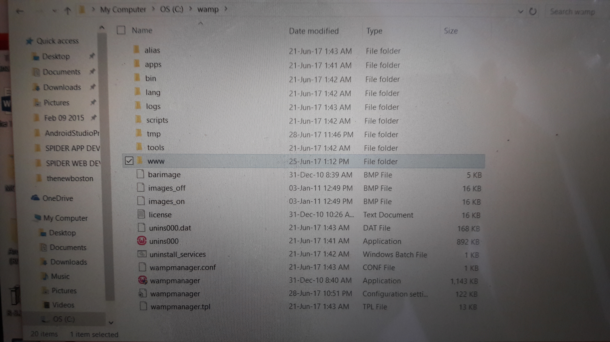
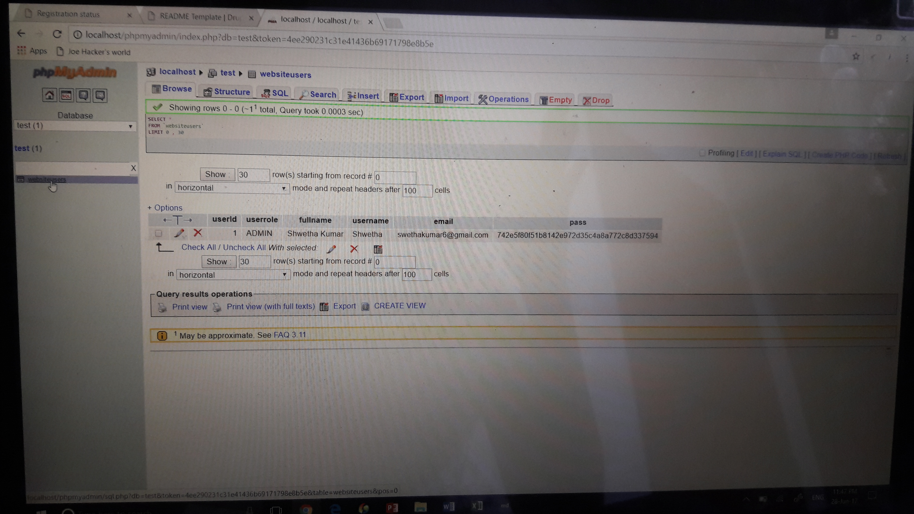

# SpiderWeb3
## INTRODUCTION

The objective of this project is to create a college notice board where students have the option to login and view notices on the bulletin board page. New students can register by giving a few credentials. Professors and teachers who have admin level user access can add notices to the bulletin board ,edit existing notes and also upgrade the access level of any existing user. All individuals on registering initially are given the default access level as a student.
***
***
## REQUIREMENTS

No external modules or libraries have been used.

___
___

## INSTALLATION

Install WAMP by clicking [here] (http://www.wampserver.com/en/). Make sure you choose the correct version depending on your OS. 
***
***
## CONFIGURATION

Follow the instructions of the SetUpWizard and install WAMP with its default settings. Once it  has been installed double click on the WampServer icon on the desktop(if the create shortcut icon on desktop option was checked) or in its requisite location and ensure that Apache  and MySQL services are running. To ensure this click on Apache and from the drop down menu click on Services. The Start/Resume service option should be greyed. Similarly it can be ensured for MySQL as well. To make any change in the PHP configuration settings open wamp from C folder(default location) or wherever else it has been installed. Then select bin, php, php5.3.5 and php (file of type Configuration Settings). If any configuration changes have been made, stop and restart the MySQL and Apache services.  

***
***
## CHECKING FOR PROPER INSTALLATION

Once WAMP has been installed, open you web browser and type localhost or 127.0.0.1 in the address bar and the WAMP home page should be opened.  If it shows some error, it means the installation was not properly done. 
***
***
## GETTING STARTED

Open WAMP folder from C or its installed location and click on www.  It is the folder which should contain the files of our project.. It would already contain an index.php file which corresponds to the page which opens up when  localhost is entered in the address bar of our web browser. Copy and paste the project files in www. Type localhost/(project name) which in this case is SpiderWeb3 in the address bar of your web browser and the notice board home page which corresponds to the index.php file of the project. All projects must have an index.php file as it is the default file which is run when any project is executed. 

***
***
## REQUISITES FOR THE PROJECT

The first user to be registered must have username Shwetha and password shwetha. This user is by default given access level of admin. Only by logging in through this user's account can admin level privileges such as adding and deleting notes and upgrading access level of other users be accessed. Also, ensure to carefully type in the username and password of new users while registering and not make any spelling mistakes. .
***
***
## TABLE CREATED IN DATABASE

The table WebsiteUsers created in the database can be viewed under test option under phpmyadmin option in the WAMP home page which opens up on typing localhost in the address bar of your web browser.  It displays a userId , which is automatically incremented for each user, userrole which is an indication of the access level of that user, fullname, email, username and password, which has been hashed to protect the account against any form of hacking. 

***
***
## TROUBLESHOOTING
1. Ensure that you register a user only once.
2. If after logging in you get a blank page go back and login again. You must have made an error in the username or password or you would have registered that user twice.
3. If you are entering through an admin account make sure you save the changes made to the notes after adding or editing them.

